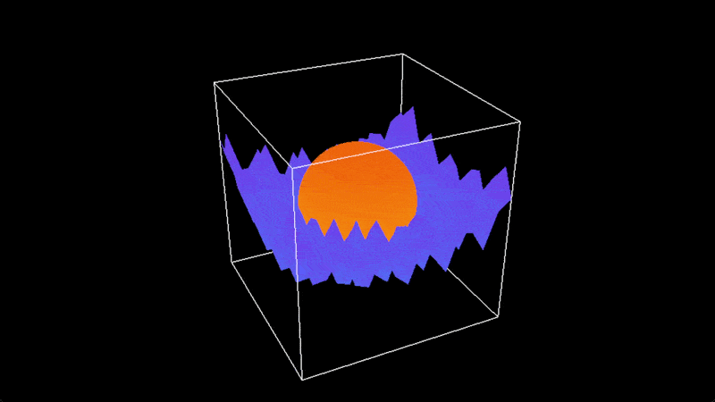

Game engine for my various solo projects. [Doc](https://nikowa.github.io/willow/).

## Components

| Name             | Abbreviation |
| ---------------- | ------------ |
| Base             | bs           |
| Window           | wd           |
| Graphics         | gx           |
| Audio            | au           |
| Asset Management | am           |
| Dynamic Loading  | dl           |
| Input            | ip           |
| Draw             | dr           |
| GUI              | gi           |
| Meta             | mt           |
| Dialogue         | dg           |
| Plot             | pt           |
| Mesh             | ms           |
| Physics          | px           |
| Scene            | sn           |

## Roadmap

- [x] OpenGL rendering backend
- [x] Asset manager
- [x] Effects system
- [x] Scene tree
- [x] Batched renderer
- [x] Sprites demo
- [x] Input demo
- [x] GUI demo
- [ ] Graph demo
- [ ] Sync demo
- [ ] Physics system
- [ ] Node-based effect editor demo
- [ ] Multi-threaded physics demo
- [ ] Fixed-camera platformer demo
- [ ] Vulkan rendering backend
- [ ] WGPU rendering backend
- [ ] DirectX rendering backend
