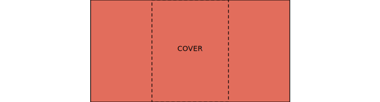
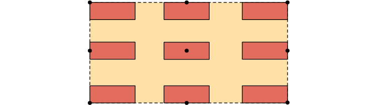
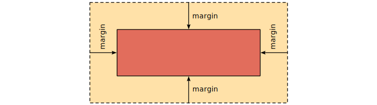
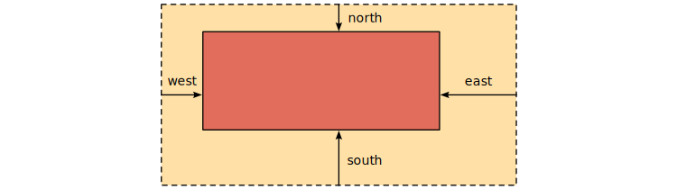
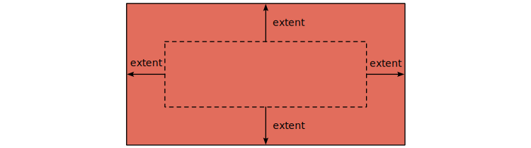
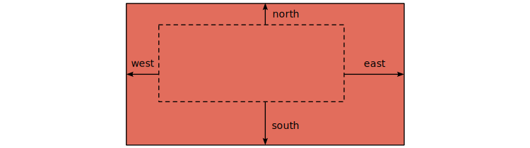
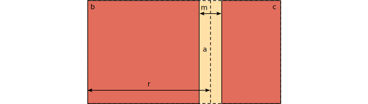

# ui

## rect

Various layout construction procedures that operate on rectangles.

#### `ui_rect_hovered`

```c
ui_rect_hovered :: proc(r: Rect) -> bool
```

#### `ui_rect_sect`

```c
ui_rect_sect :: proc(a, b: Rect) -> (c: Rect)
```


#### `ui_rect_union`

```c
ui_rect_union :: proc(a, b: Rect) -> (c: Rect)
```


#### `ui_rect_interpolate`

```c
ui_rect_interpolate :: proc(r: Rect, t: [2]f32) -> (p: [2]f32)
```


#### `ui_rect_interpolate_centered`

```c
ui_rect_interpolate_centered :: proc(r: Rect, t: [2]f32) -> (p: [2]f32)
```


#### `ui_rect_fit`

```c
ui_rect_fit :: proc(
	rect, container: Rect,
	fit: UI_Fit) -> (result: Rect)

UI_Fit :: enum {
	NONE,
	FILL,
	COVER,
	CONTAIN,
	SCALE_DOWN }
```





#### `ui_rect_embed`

```c
ui_rect_embed :: proc(
	rect: Rect,
	size: [2]f32,
	pivot: bit_set[Compass] = {}) -> (result: Rect)
```



#### `ui_rect_margins`

```c
ui_rect_margins :: proc {
	ui_rect_margins_i,
	ui_rect_margins_r }
```

```c
ui_rect_margins_i :: proc(
	rect: Rect,
	margin: Interval) -> (result: Rect)
```

```c
ui_rect_margins_r :: proc(
	rect: Rect,
	margin: Ratio) -> (result: Rect)
```



#### `ui_rect_margins_variate`

```c
ui_rect_margins_variate :: proc {
	ui_rect_margins_variate_r,
	ui_rect_margins_variate_i }
```

```c
ui_rect_margins_variate_r :: proc(
	rect: Rect,
	west: Ratio = 0,
	east: Ratio = 0,
	south: Ratio = 0,
	north: Ratio = 0) -> (result: Rect)
```

```c
ui_rect_margins_variate_i :: proc(
	rect: Rect,
	west: Interval = 0,
	east: Interval = 0,
	south: Interval = 0,
	north: Interval = 0) -> (result: Rect)
```



#### `ui_rect_extend`

```c
ui_rect_extend :: proc {
	ui_rect_extend_i,
	ui_rect_extend_r }
```

```c
ui_rect_extend_i :: proc(
	rect: Rect,
	extent: Interval) -> (result: Rect)
```

```c
ui_rect_extend_r :: proc(
	rect: Rect,
	extent: Ratio) -> (result: Rect)
```



#### `ui_rect_extend_variate`

```c
ui_rect_extend_variate :: proc {
	ui_rect_extend_variate_r,
	ui_rect_extend_variate_i }
```

```c
ui_rect_extend_variate_r :: proc(
	rect: Rect,
	west: Ratio = 0,
	east: Ratio = 0,
	south: Ratio = 0,
	north: Ratio = 0) -> (result: Rect)
```

```c
ui_rect_extend_variate_i :: proc(
	rect: Rect,
	west: Interval = 0,
	east: Interval = 0,
	south: Interval = 0,
	north: Interval = 0) -> (result: Rect)
```



#### `rect_split_h`

```c
rect_split_h :: proc(a: Rect, s, m: Ratio) -> (b, c: Rect)
```

```c
rect_split_h :: proc(a: Rect, s, m: Interval) -> (b, c: Rect)
```

```c
rect_split_h :: proc(a: Rect, s: Ratio, m: Interval) -> (b, c: Rect)
```

```c
rect_split_h :: proc(a: Rect, s: Interval, m: Ratio) -> (b, c: Rect)
```


