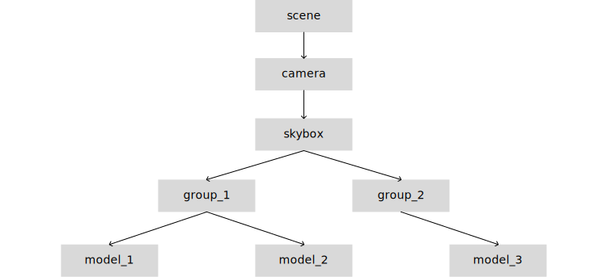

# Architecture

## Top-Level

There are 4 primary layers: *base*, *core*, *app*, and *ext*. Each layer is dependent on the layers below it and independent from the layers above it. The layer *app* is split into *game* and *tool*. You'll most likely use *base* + *core* or *base* + *core* + *app*. The layer *ext* is for optional extensions to any of the components of the layers below it.


- **1. base** --- general procedures and data structured
	- 1.1. *bs*
- **2. core** --- essential engine components
	- *wd* --- window
	- *gx* --- graphics
	- *au* --- audio
	- *am* --- asset management
	- *dl* --- dynamic loading
	- *ip* --- input
	- *dr* --- draw
	- *ui* --- user interface
	- *mt* --- meta
	- *ms* --- mesh
	- *px* --- physics
- **3. app/game** --- auxiliary components for game development
	- *sn* --- scene
	- *dg* --- dialogue
	- *ec* --- entity component system
	- *fx* --- graphical effects
	- *sm* --- state machine
	- *ai* --- ai
- **3. app/tool** --- auxiliary components for application & tool development
	- *pt* --- plot
	- *ti* --- tools interface
- **4. ext** --- extensions to components from the layers bellow

## Context Trees

Certain families of objects—eg. entities in a scene, widgets in a GUI, commands in a render graph—naturally form a tree-like structure, where adjacent nodes have a *child*-*parent* relationship, and generally the parent provides some kind of context to the child, such that any procedure that constructs/processes the child requires to know who it's parent is (and who the parent of it's parent is and so on).



Procedures that operate on these object have three variants, each having a distinct way of gathering the needed parameters.

1. **immediate mode (IM)** --- All the parameters are given directly to the procedure, such that you don't have to construct a tree or manage any auxiliary state.
2. **stack-retained mode (SRM)** --- Some of the parameters are gathered from parameter stacks, which represent the chain of nodes from the current object to the root node.
3. **tree-retained mode (TRM)** --- The procedure is given a pointer to a node in an actual tree and it gathers the parameters by walking the tree.

Here's an example with `dr_model`:

```c
dr_model :: proc { dr_model_im, dr_model_srm, dr_model_trm }

// Immediate Mode //
dr_model_im(env, cam, model_1)
dr_model_im(env, cam, model_2)
dr_model_im(env, cam, model_3)

// Stack-Retained Mode //
push_env(env)
push_cam(cam)
dr_model_srm(model_1)
dr_model_srm(model_2)
dr_model_srm(model_3)

// Tree-Retained Mode //
dr_model_trm(node, model_1)
dr_model_trm(node, model_2)
dr_model_trm(node, model_3)
// (Goes up the graph until it finds a camera node or an env node.)
```
