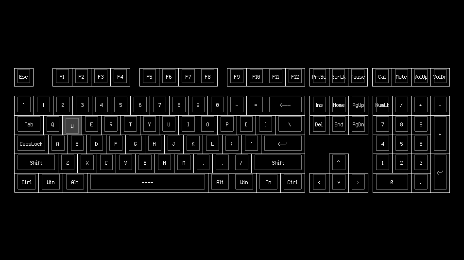
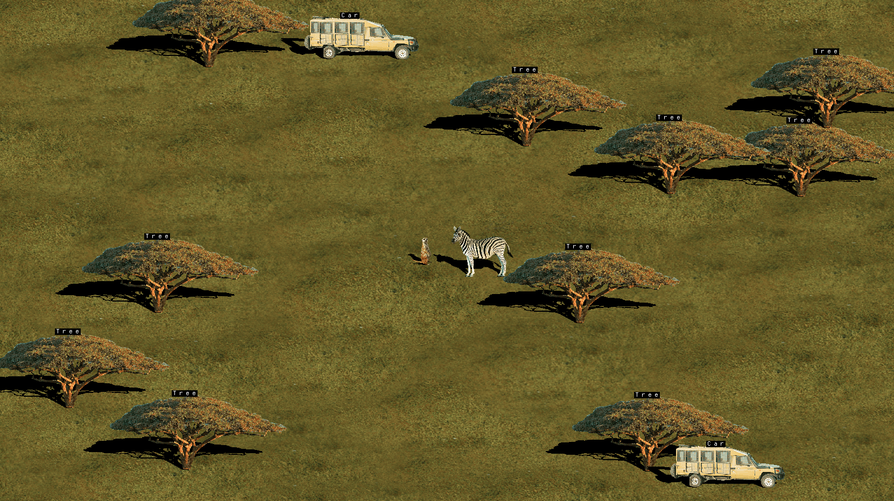

# Examples

## Input

The input example demonstrates how to handle inputs using the `input` module, and how to use the `graphics/gui` module to draw a keyboard that responds to your inputs.

## Sync

The sync example demonstrates the `willow/multi` module. It is a multi-threaded agent-based simulation, where numerous entities are simulated in parallel, exhibiting complex behavior and exchanging state at arbitrary moments of interaction.
