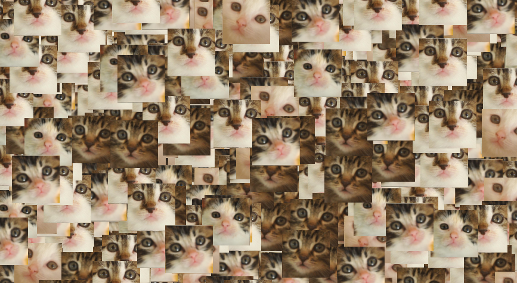
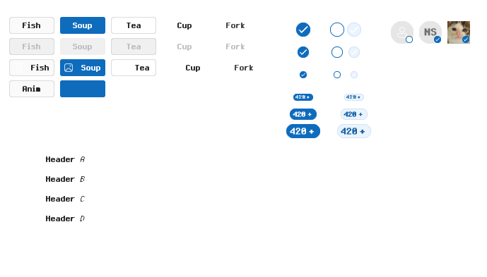
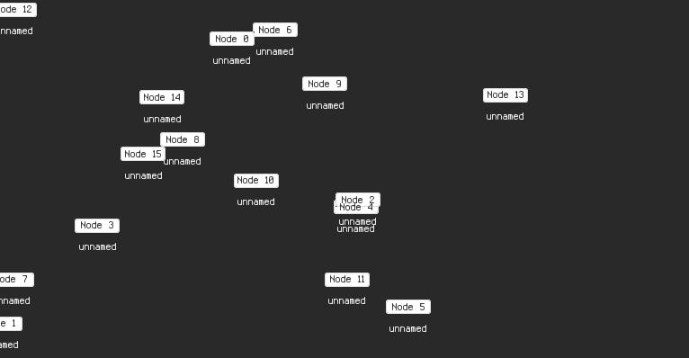

# Examples

## Sprites

Draws a bunch of moving sprites. Intended to test command batching.

## Input

Draws a keyboard inputs visualizater. Intended to test input handling.

## Neon

Draws a gallery of Windows-11-style widgets. Intended to test UI control and hierarchical 2D rendering.

## Graph

Draws a directed graph of nodes. Intended to test plotting.

## Sync

Intended to test thread synchronization.
