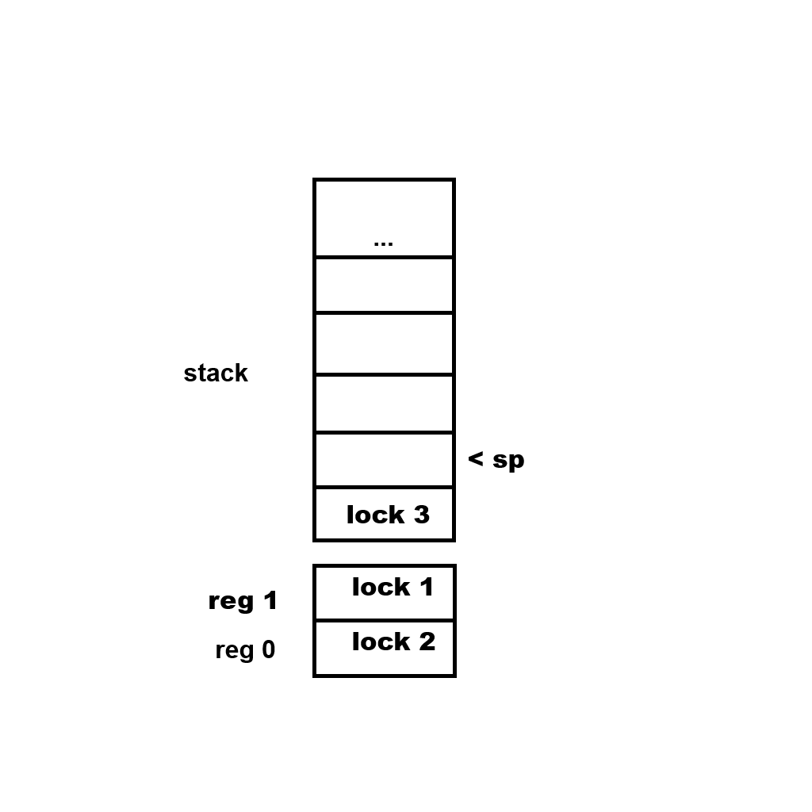

# Overview


_Willow_ is a game engine, made for my games _Bogwalker_ and _The Blue Break_ (and other games I might make in the future). It is very unstable and has many missing features.

At the start you give a fixed *memory cap* number to `base.init` and this is the maximum amount of memory that your threads will be able to allocate.

You also give it a fixed *readonly memory cap* which is used to allocate a range of read-only memory, which will be accessible by all threads without the need for synchronization. The readonly memory must be initialized before you call `base.start`, and then `base.start` will hash it and in debug mode this hash will be used to verify the integrity of this read-only memory.

`base.start` will determine the optimal number of threads and create that many threads and call `entry_point` on all those threads including the main thread. Do not touch `context.user_ptr`, that's where `thread_data` is stored, and it's needed.

```c
main :: proc() {
	MEMORY_CAP :: 100000
	READONLY_MEMORY_CAP :: 1000
	base.init(MEMORY_CAP, READONLY_MEMORY_CAP)
	// ...
	base.start(entry_point) }

entry_point :: proc(thread_data: ^base.Thread_Data) {
	// ...
	return }
```

The basic premise of the multi-threading architecture is that the memory is split into *cages*, where each cage is an interval with a lock. Each thread has a *keeper* and a keeper can own no more than 2 cages at a time. To acquire a cage call `base.acquire_cage` and give it some point from the interval of that cage. If you attempt to acquire more than 2 cages, it will return `false` and an error will be printed. You can release a cage by `base.acquire_cage` with a pointer from the interval of that cage. The helper function `keeper_swap_by_lock` can be used to release one cage and acquire another in one sweeping motion.


## The Lock System



Every thread is able to own at most 2 locks at a time. This is the bare minimum number of locks necessary for any algorithm. The containers for these two locks are called the *lock registers*. In addition, every thread has a *lock stack*. This allows for lock pairs to be managed in larger, nested scopes, as opposed to small disjoint scopes. If a procedure that has acquired lock A and B wants to call a procedure that depends on locks B and C, normally it would call a sync function to acquire lock C at the start and then call a sync function to release it at the end, but in my system, it can call a sync function at the start to acquire lock C and hint that lock A is no longer needed, and then call a sync function to release it at the end. And what happens in the background is, A is released and push into the lock stack, then B and C are acquired in order, and at the end C is released and A is popped from the stack and A and B are acquired in order. The stack is necessary so that the callee can remember what locks were owned by the caller and restore them.

## Multi-Threading

For Willow's thread synchronization to work without errors, your package needs to follow a set of rules. To check if it does, you can run the willow checker on your package, like this:

```
willow check <package_dir>
```

Informally, the rules are:

- Every *sync-safe* function must declare which locks it's going to own immediately at its beginning, by calling one of Willow's lock methods. A *sync-safe* function is a function with the `@(tag="sync_safe")` tag.
- Willow's lock methods should not be used anywhere else except at the immediate beginning of a *sync-safe* function.
- A *sync-safe* function must return immediately if the lock method in it returned false.
- A *sync-safe* function must not access any global variables.
- A *sync-safe* function must not have any arguments of pointer type or arguments of types that contain pointers.

```c

```

## Allocators and Mutexes

- No global state allowed
- Every mutex is associated with a memory interval
- Function is not allowed to take as inputs pointers from memory intervals outside of the intervals of the two mutexes they've acquired

## Start
