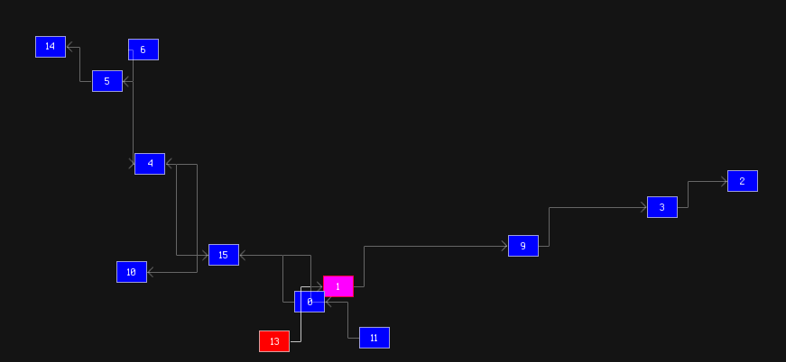
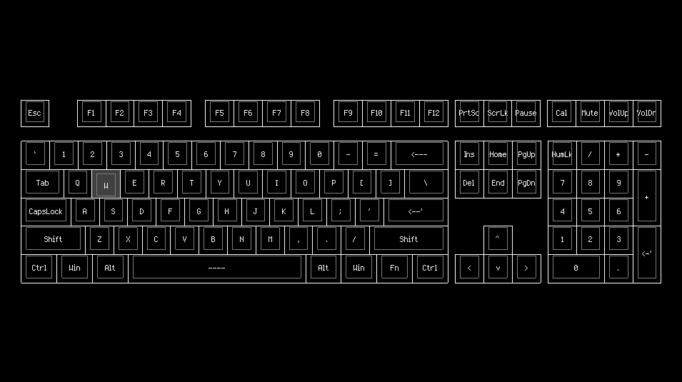
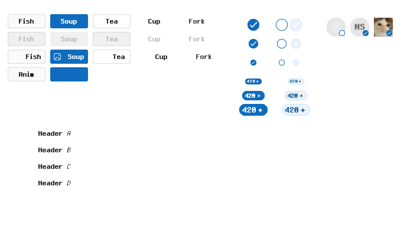
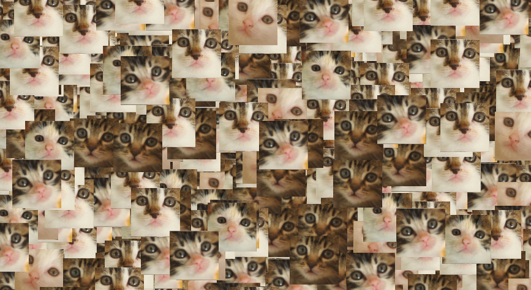
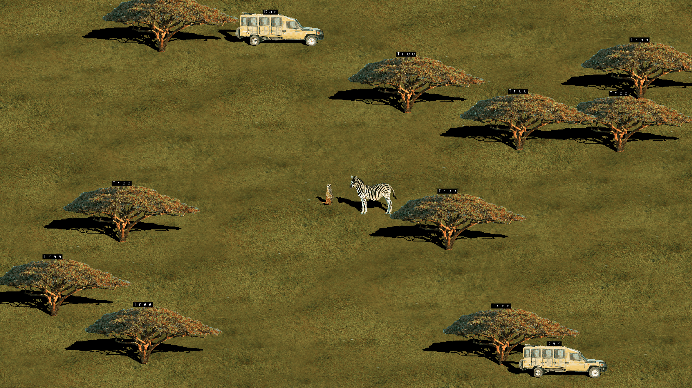

# Examples

All the examples are listed here. Their source code and pre-compiled binaries can be found in the `examples/` folder. Currently I am using these for testing the correctness and performance of the various systems. Most of the ones that have screenshots are complete. Most of the ones that don't are incomplete.

## Collage

Demonstrates the usage of a complex render graph with many data dependencies, using various shaders to produce a collage-like image.

## Graph

Draws a directed graph of nodes. Intended to test plotting.

## GUI

Demonstrates the UI layout procedures by drawing an interesting and dynamic layout.

## Input

Draws a keyboard inputs visualizater. Intended to test input handling.

## Modes

Demonstrates the 3 different modes of tree processing.

## MRT

Demonstrates a shader that draws to multiple target textures with a single draw call.

## Neon

Draws a gallery of Windows-11-style widgets. Intended to test UI control and hierarchical 2D rendering.

## Paint

A recreation of Microsoft Paint.

## Prop

Renders a high-poly prop with nice lighting.

## Sprites

Draws a bunch of moving sprites. Intended to test command batching.

## Sync

Intended to test thread synchronization.
