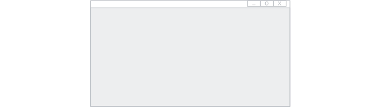
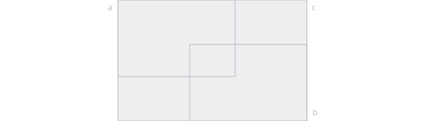
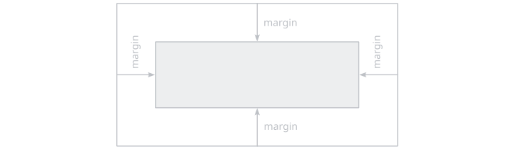
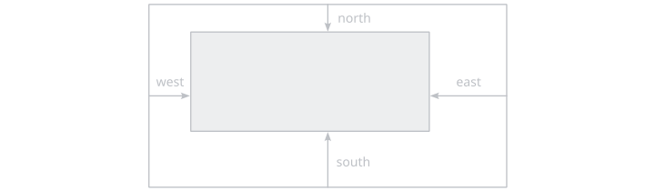
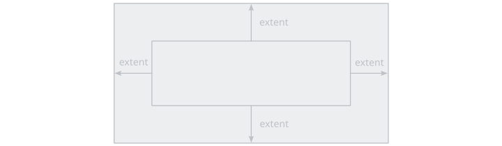
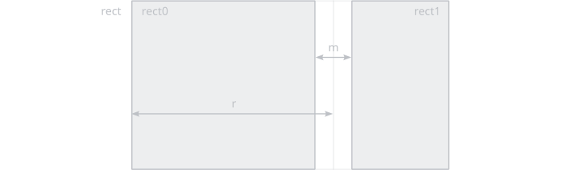
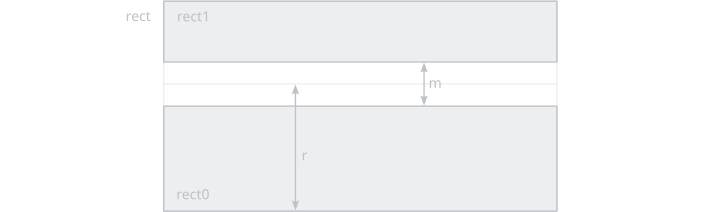
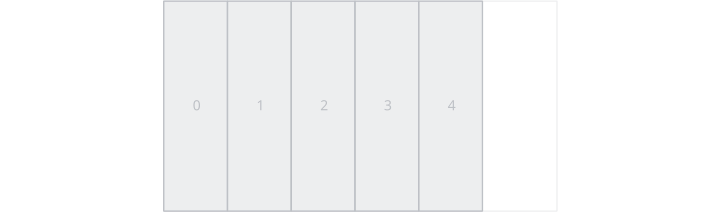

# ui/rect

Procedures for manipulating rectangles for UI purposes.

### `screen`

```odin
ui_rect_screen :: proc() -> Rect
```



Creates a rect that covers the entire window.

### `hovered`

```odin
ui_rect_hovered :: proc(
	rect: Rect) -> bool
```

Checks if the rect is hovered by the cursor.

### `sect`

```odin
ui_rect_sect :: proc(
	rect0: Rect,
	rect1: Rect) -> (rect2: Rect)
```


Creates a rect at the intersection of two rects.

### `union`

```odin
ui_rect_union :: proc(
	rect0: Rect,
	rect1: Rect) -> (rect2: Rect)
```



Creates a rect at the union of two rects.

### `lerp`

```odin
ui_rect_lerp :: proc(
	rect: Rect,
	t: [2]f32) -> (p: [2]f32)
```


Interpolate between the bottom-left corner and the top-right corner of a rect.

### `lerp_centered`

```odin
ui_rect_lerp_centered :: proc(
	rect: Rect,
	t: [2]f32) -> (p: [2]f32)
```


Interpolate between the center and the top-right corner of a rect.

### `unlerp`

```odin
ui_rect_unlerp :: proc(
	rect: Rect,
	p: [2]f32) -> (t: [2]f32)
```


Inverse-interpolate between the bottom-left corner and the top-right corner of a rect.

### `unlerp_centered`

```odin
ui_rect_unlerp_centered :: proc(
	rect: Rect,
	p: [2]f32) -> (t: [2]f32)
```


Inverse-interpolate between the center and the top-right corner of a rect.

### `fit`

```odin
ui_rect_fit :: proc(
	rect: Rect,
	size: [2]f32,
	fit: UI_Fit) -> (result: Rect)
```


/// caption
`.None`
///

`.None` does nothing.


/// caption
`.Fill`
///

`.Fill` sets the size to the size of `rect`.


/// caption
`.Cover`
///

`.Cover` preserves the aspect ratio while using the smallest possible size that fully covers `rect`.


/// caption
`.Contain`
///

`.Contain` preserves the aspect ratio while using the largest possible size that fully fits inside `rect`.

### `embed`

```odin
ui_rect_embed :: proc(
	rect: Rect,
	size: [2]f32,
	pivot: bit_set[Compass] = {}) -> (result: Rect)
```


Place a rect of a certain size inside `rect`, embedded in a corner or at the center of an egde or at the center of `rect`.

### `margins`

```odin
ui_rect_margins :: proc(
	rect: Rect,
	margin: Interval) -> (result: Rect)
```

```odin
ui_rect_margins :: proc(
	rect: Rect,
	margin: Ratio) -> (result: Rect) {
```



Adds margins of `margin` on all sides. Inverse of [extend](#extend).

### `margins_variate`

```odin
ui_rect_margins_variate :: proc(
	rect: Rect,
	west: Ratio = 0,
	east: Ratio = 0,
	south: Ratio = 0,
	north: Ratio = 0) -> (result: Rect)
```

```odin
ui_rect_margins_variate :: proc(
	rect: Rect,
	west: Interval = 0,
	east: Interval = 0,
	south: Interval = 0,
	north: Interval = 0) -> (result: Rect)
```



Adds variate margins. Inverse of [extend_variate](#extend_variate).

### `extend`

```odin
ui_rect_extend :: proc(
	rect: Rect,
	extent: Interval) -> (result: Rect)
```

```odin
ui_rect_extend :: proc(
	rect: Rect,
	extent: Ratio) -> (result: Rect)
```



Extend the rect by `extent` on all sides. Inverse of [margins](#margins).

### `extend_variate`

```odin
ui_rect_extend_variate :: proc(
	rect: Rect,
	west: Ratio = 0,
	east: Ratio = 0,
	south: Ratio = 0,
	north: Ratio = 0) -> (result: Rect)
```

```odin
ui_rect_extend_variate :: proc(
	rect: Rect,
	west: Interval = 0,
	east: Interval = 0,
	south: Interval = 0,
	north: Interval = 0) -> (result: Rect)
```


Extend the rect by a different amount on each side. Inverse of [margins_variate](#margins_variate).

### `split_h`

```odin
ui_rect_split_h :: proc(
	rect: Rect,
	ratio: Ratio,
	margin: Ratio) -> (rect0: Rect, rect1: Rect)
```

```odin
ui_rect_split_h :: proc(
	rect: Rect,
	ratio: Ratio,
	margin: Interval) -> (rect0: Rect, rect1: Rect)
```

```odin
ui_rect_split_h :: proc(
	rect: Rect,
	s: Interval,
	margin: Ratio) -> (rect0: Rect, rect1: Rect)
```

```odin
ui_rect_split_h :: proc(
	rect: Rect,
	s: Interval,
	margin: Interval) -> (rect0: Rect, rect1: Rect)
```



Splits a rect horizontally at `s` and leave a margin of `m` at the splitting line.

### `split_v`

```odin
ui_rect_split_v :: proc(
	rect: Rect,
	ratio: Ratio,
	margin: Ratio) -> (rect0: Rect, rect1: Rect)
```

```odin
ui_rect_split_v :: proc(
	rect: Rect,
	ratio: Ratio,
	margin: Interval) -> (rect0: Rect, rect1: Rect)
```

```odin
ui_rect_split_v :: proc(
	rect: Rect,
	s: Interval,
	margin: Ratio) -> (rect0: Rect, rect1: Rect)
```

```odin
ui_rect_split_v :: proc(
	rect: Rect,
	s: Interval,
	margin: Interval) -> (rect0: Rect, rect1: Rect)
```



Splits a rect vertically at `s` and leave a margin of `m` at the splitting line.

### `slice_h`

```odin
ui_rect_slice_h :: proc(
	a: Rect,
	s: Interval,
	n_max: int,
	rects: ^[dynamic]Rect,
	inverse: bool = false)
```

```odin
ui_rect_slice_h :: proc(
	a: Rect,
	size: Interval,
	n_max: int,
	allocator := context.allocator,
	inverse: bool = false) -> (result: []Rect)
```

```odin
ui_rect_slice_h :: proc(
	a: Rect,
	s: Ratio,
	n_max: int,
	rects: ^[dynamic]Rect,
	inverse: bool = false)
```

```odin
ui_rect_slice_h :: proc(
	a: Rect,
	s: Ratio,
	n_max: int,
	allocator := context.allocator,
	inverse: bool = false) -> (result: []Rect)
```



Slices a rect horizontally into a number (capped by `n_max`) of equally-wide rects. If `inverse` is false, the slices start at the left side, otherwise at the right.

### `slice_v`

```odin
ui_rect_slice_v :: proc(
	rect: Rect,
	size: Interval,
	n_max: int,
	result: ^[dynamic]Rect,
	inverse: bool = false)
```

```odin
ui_rect_slice_v :: proc(
	rect: Rect,
	size: Interval,
	n_max: int,
	allocator := context.allocator,
	inverse: bool = false) -> (result: []Rect)
```

```odin
ui_rect_slice_v :: proc(
	rect: Rect,
	size: Ratio,
	n_max: int,
	result: ^[dynamic]Rect,
	inverse: bool = false)
```

```odin
ui_rect_slice_v :: proc(
	rect: Rect,
	size: Ratio,
	n_max: int,
	allocator := context.allocator,
	inverse: bool = false) -> (result: []Rect)
```


Slices a rect vertically into a number (capped by `n_max`) of equally-high rects. If `inverse` is false, the slices start at the bottom side, otherwise at the top.

### `grid`

```odin
ui_rect_grid :: proc(
	rect: Rect,
	shape: [2]int,
	result: ^[dynamic]Rect)
```

```odin
ui_rect_grid :: proc(
	rect: Rect,
	shape: [2]int,
	allocator := context.allocator) -> (result: []Rect)
```


Splits a rect into a matrix of equally-sized rects.

### `mirror_x`

```odin
ui_rect_mirror_x :: proc(
	rect: Rect) -> (result: Rect)
```

```odin
ui_rect_mirror_x :: proc(
	rect: Rect,
	offset: f32) -> (result: Rect)
```

Mirrors a rect horizontally across `0`, or across a specified `offset`.

### `mirror_y`

```odin
ui_rect_mirror_y :: proc(
	rect: Rect) -> (result: Rect)
```

```odin
ui_rect_mirror_y :: proc(
	rect: Rect,
	offset: f32) -> (result: Rect)
```

Mirrors a rect vertically across `0`, or across a specified `offset`.

### `merge`

```odin
ui_rects_merge :: proc(
	rect0: Rect,
	rect1: Rect) -> (result: Rect)
```

Merge two rects.

```odin
ui_rects_merge :: proc(
	rects: ^[dynamic]Rect,
	range: [2]int,
	remove_range: bool=true)
```

Merge a range of rects from a dynamic array. If `remove_range` is true, the rects in-between are removed.

### `remove_range`

```odin
ui_rects_remove_range :: proc(
	rects: ^[dynamic]Rect,
	range: [2]int)
```

Remove a range of rects from a dynamic array.

### `rotate`

```odin
ui_rect_rotate :: proc(
	rect: Rect) -> (result: Rect)
```

Rotate a rect by $90 \degree$, ie. swap it's `x` and `y` size.

### `translate`

```odin
ui_rect_translate :: proc(
	rect: Rect,
	offset: [2]f32) -> (result: Rect)
```

Adds `offset` to the position of `rect`.

### `scale`

```odin
ui_rect_scale :: proc(
	rect: Rect,
	scale: [2]f32) -> (result: Rect)
```

Multiplies `scale` by the size of `rect`.

### `resize`

```odin
ui_rect_resize :: proc(
	rect: Rect,
	size: [2]f32) -> (result: Rect)
```

Sets the size of `rect` to `size`.

### `top_to`

```odin
ui_rect_top_to :: proc(
	rect: Rect,
	target: f32) -> (result: Rect)
```

Translates the rect vertically such that it's top side is at `target`.

### `bottom_to`

```odin
ui_rect_bottom_to :: proc(
	rect: Rect,
	target: f32) -> (result: Rect)
```

Translates the rect vertically such that it's bottom side is at `target`.

### `left_to`

```odin
ui_rect_left_to :: proc(
	rect: Rect,
	target: f32) -> (result: Rect)
```

Translates the rect horizontally such that it's left side is at `target`.

### `right_to`

```odin
ui_rect_right_to :: proc(
	rect: Rect,
	target: f32) -> (result: Rect)
```

Translates the rect horizontally such that it's right side is at `target`.

### `position_top`

```odin
ui_rect_position_top :: proc(
	rect: Rect,
	target: f32) -> (result: Rect)
```

Move the top side of the `rect` to `target`.

### `position_bottom`

```odin
ui_rect_position_bottom :: proc(
	rect: Rect,
	target: f32) -> (result: Rect)
```

Move the bottom side of the `rect` to `target`.

### `clamp`

```odin
rect_clamp :: proc(
	bounds: Rect,
	point: [2]f32) -> (result: [2]f32)
```

Clamps a point to the `bounds` rect.

```odin
rect_clamp :: proc(
	bounds: Rect,
	rect: Rect) -> (result: Rect)
```

Clamps a rect to the `bounds` rect.

<pre>


</pre>
