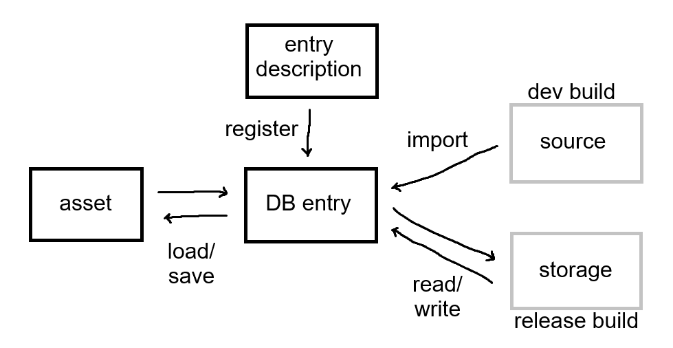

# Database

_TODO:_ Rename to asset manager.



Database is an abstraction layer between the in-memory and on-disk representations of assets. It's purpose is to make it so you don't have to think about where the assets are coming from and to automate updating and reloading them.

Assets are identified by a string URL. The URL has the form `<kind>:<name>`. The intended way of managing assets is by registering their kinds at initialization time, then loading them and then saving them at deinitialization time; The database will automatically do the importing, reading, and writing for you. However, if you want, you can also import, read, or write manually.

By setting the `watch` field on `Asset_Manager_Config`, you can enable the asset manager to watch for changes and automatically read, import, or load assets. This can allow you to edit assets while the game is running and see changes in real time.

### Types

#### `URL`

```c
URL :: distinct string
```

#### `Database_Config`

```c
Database_Config :: struct {
	relpath: string,
	source_directory_relpath: string }
```

#### `Database`

```c
Database :: struct {
	using config: Database_Config,
	entries: [dynamic]Entry,
	entries_map: map[URL]^Entry }
```

#### `Entry_Config`

```c
Entry_Config :: struct {
	url: URL,
	modification_time: tm.Time,
	compressed: b8,
	data: []u8 }
```

#### `Entry`

```c
Entry :: struct {
	using config: Entry_Config }
```

#### `Serialize_Proc`

```
Serialize_Proc :: #type proc(
	data: rawptr,
	size: u32,
	allocator: rt.Allocator) -> (bytes: []u8, err: os.Error)
```

#### `Deserialize_Proc`

```
Deserialize_Proc :: #type proc(
	bytes: []u8,
	allocator: rt.Allocator) -> (data: rawptr, size: u32, err: os.Error)
```


#### `make_database`

Database constructor.

```c
make_database :: proc(
	config: Database_Config,
	allocator: rt.Allocator) -> (database: Database)
```

#### `delete_database`

Database destructor.

```c
delete_database :: proc(
	database: Database,
	allocator: rt.Allocator)
```

#### `make_entry`

Entry constructor.

```c
make_entry :: proc(
	url: URL,
	data: []u8,
	modification_time: tm.Time = { },
	compressed: b8 = false) -> (entry: Entry)
```

#### `delete_entry`

Entry destructor.

```c
delete_entry :: proc(
	entry: Entry,
	allocator: rt.Allocator)
```

#### `entry_equiv`

Check if two entries are equivalent (equivalent URL, equivalent data, equivalent compressedness state).

```c
entry_equiv :: proc(
	entry_a: ^Entry,
	entry_b: ^Entry)
```

#### `entry_from_url`

Retreive entry from database by URL.

```c
entry_from_url :: proc(
	database: ^Database,
	url: URL) -> (entry: ^Entry, ok: bool)
```

#### `contains_entry`

Check if database contains entry with given URL.

```c
contains_entry :: proc(
	database: ^Database,
	url: URL) -> bool
```

#### `add_entry`

Add entry to database.

```c
add_entry :: proc(
	database: ^Database,
	entry_config: Entry_Config) -> (entry_ptr: ^Entry, err: os.Error)
```

#### `add_or_update_entry`

Add entry to database; If exists, update it.

```c
add_or_update_entry :: proc(
	database: ^Database,
	entry_config: Entry_Config) -> (entry_ptr: ^Entry, err: os.Error)
```

#### `remove_entry`

Remove entry from database.

```c
remove_entry :: proc(
	database: ^Database,
	entry: ^Entry)
```

#### `clone_entry`

Clone an entry.

```c
clone_entry :: proc(
	entry: ^Entry,
	allocator: rt.Allocator) -> (entry_clone: Entry)
```

#### `clone`

Clone a database.

```c
clone :: proc(
	database: ^Database,
	allocator: rt.Allocator) -> (database_clone: Database)
```

#### `equiv`

Check if two databases are equivalent (have equivalent entries).

```c
equiv :: proc(
	database_a,
	database_b: ^Database) -> bool
```

#### `relpath_to_path`

Convert a relative path string (relative to the directory of the executable) to an absolute path string.

```c
relpath_to_path :: proc(
	relpath: string,
	allocator: rt.Allocator) -> (path: string)
```

#### `relpath_to_source_path`

Convert a relative path string (relative to the source directory of the database) to an absolute path string.

```c
relpath_to_source_path :: proc(
	database: ^Database,
	relpath: string,
	allocator: rt.Allocator) -> (path: string)
```

#### `path_to_relpath`

Convert an absolute path string to a relative path string (relative to the directory of the executable).

```c
path_to_relpath :: proc(
	path: string,
	allocator: rt.Allocator) -> (relpath: string)
```

#### `make_or_read_database`

Check if a database exists at the given relative path. If it exists, read it; If it does not exist, construct a new one.

```c
make_or_read_database :: proc(
	config: Database_Config,
	allocator: rt.Allocator) -> (database: Database)
```

#### `read`

Read the database at the given relative path.

```c
read :: proc(
	relpath: string,
	allocator: rt.Allocator) -> (database: Database)
```

#### `write`

```c
compress_and_write :: proc(
	database: ^Database,
	allocator: rt.Allocator)
```

#### `remove_database`

Remove the database file from disk.

```c
remove_database :: proc(
	database: ^Database) -> (err: os.Error)
```

#### `url_join`

```c
url_join :: proc(
	urls: []URL,
	allocator: rt.Allocator) -> URL
```

#### `url_split`

```c
url_split :: proc(
	url: URL,
	allocator: rt.Allocator) -> (res: []string)
```

#### `relpath_from_url`

Get the relative path (relative to the source directory of the database) of the source of the entry with the given URL.

```c
relpath_from_url :: proc(
	database: ^Database,
	url: URL,
	allocator: rt.Allocator) -> (path: string)
```

#### `path_from_url`

Get the absolute path of the source of the entry with the given URL.

```c
path_from_url :: proc(
	database: ^Database,
	url: URL,
	allocator: rt.Allocator) -> (path: string)
```

#### `entry_outdated`

Check if the source of the given entry has been updated since the entry was imported to the database.

```c
entry_outdated :: proc(
	database: ^Database,
	entry: ^Entry) -> (outdated: bool)
```

#### `entry_update`

Update the contents of an entry.

```c
entry_update :: proc(
	entry: ^Entry,
	config: Entry_Config)
```

#### `url_search_source`

```c
url_search_source :: proc(
	database: ^Database,
	url: URL,
	allocator: rt.Allocator) -> (path: string, err: os.Error)
```

<details><summary>Description</summary>
Get the path of the first file in the database's source directory that has the a name matching the given URL.
</details>

#### `file_was_modified`

```c
file_was_modified :: proc(
	relpath: string,
	modification_time: ^tm.Time) -> (was_modified: bool)
```

<details><summary>Description</summary>
Watch a given file for modifications. The modification_time parameter is where the latest modification time is stored. Whenever the file is modified, this function will return `true`. This will happen only once per modification. Example:

```
modification_time: tm.Time
for {
	game_tick()
	if file_was_modified(relpath, &modification_time) do do_something() }
```

</details>

<pre>


</pre>


