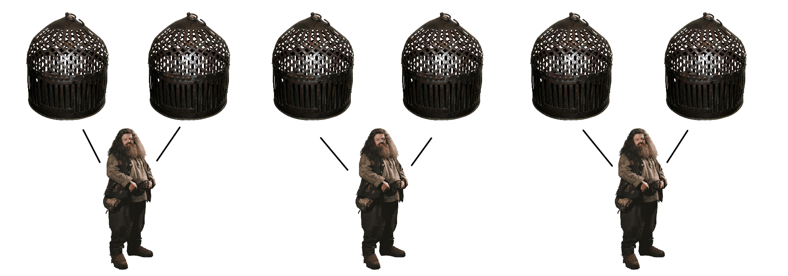

# Overview

At the start you give a fixed *memory cap* number to `base.init` and this is the maximum amount of memory that your threads will be able to allocate.

You also give it a fixed *readonly memory cap* which is used to allocate a range of read-only memory, which will be accessible by all threads without the need for synchronization. The readonly memory must be initialized before you call `base.start`, and then `base.start` will hash it and in debug mode this hash will be used to verify the integrity of this read-only memory.

`base.start` will determine the optimal number of threads and create that many threads and call `entry_point` on all those threads including the main thread. Do not touch `context.user_ptr`, that's where `thread_data` is stored, and it's needed.

```c
main :: proc() {
	MEMORY_CAP :: 100000
	READONLY_MEMORY_CAP :: 1000
	base.init(MEMORY_CAP, READONLY_MEMORY_CAP)
	// ...
	base.start(entry_point) }

entry_point :: proc(thread_data: ^base.Thread_Data) {
	// ...
	return }
```

The basic premise of the multi-threading architecture is that the memory is split into *cages*, where each cage is an interval with a lock. Each thread has a *keeper* and a keeper can own no more than 2 cages at a time. To acquire a cage call `base.acquire_cage` and give it some point from the interval of that cage. If you attempt to acquire more than 2 cages, it will return `false` and an error will be printed. You can release a cage by `base.acquire_cage` with a pointer from the interval of that cage. The helper function `keeper_swap_by_lock` can be used to release one cage and acquire another in one sweeping motion.




## Start
